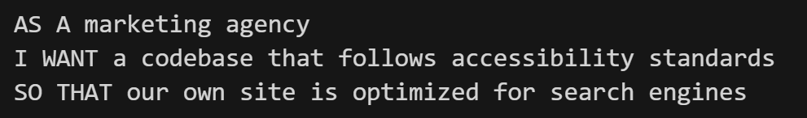
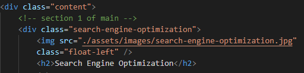
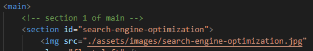

# Homework-1-Refactoring
**First homework assignment. Refactoring**

 
 
 

[Click here for the deployed application](https://jongudenzi.github.io/Homework-1-Refactoring/)
 
 

[Click here for the GitHub repository](https://github.com/JonGudenzi/Homework-1-Refactoring)
 
 
This website is an advertizing agency that helps businesses have more accessibility in their websites. Being that accessibility is what they offer, it is important that they themselves have this on their website. 

Our User Story for this project is to refactor a marketing agencies website to be better optimized for search engines.
Here is the user story given.

 
 
Nothing to the website's image will change with the code changes we make. The benefit of these changes will be strictly for accessibility purposes.
This is the current look of the website, which once again, will not change in design.
 

 
 
Several divs and classes had to be taken out and replaced with more semantic tags. Having more semantic tags will give this site more accessibility. Search engines will know that these semantic tags are more important.  This will cause less issues or errors than having divs and classes.
 
 

**Before with div and class:**
 

 

**After using main and section:**
 

 
 
Of course by doing this all css selectors will be changed from the class selectors that they had to the more semantic tags given.
 
 
 
 
The functionality of the page is also very important. We need to make sure all of the links and images, including attributes are working properly. 
In the case on this page, a link from the nav bar is not dirrecting to where it should. This is because a class is being used where at the part of the page it should be directed to when clicked. Because it's a class instead of an id this link will not work.  This will also be corrected as shown below.
 
 

**Before: Using class instead of id**
 
 

 
 

**After: Using id to correct direct link from the nav bar**
 
 

 
 
 
 
 
 
Page loading speed is important as well. By combining as many css selectors with identical properties as we can will speed up the load and refresh of the page. This will happen by reducing the amount of http requests from the browser.
Here is an example of this on this webpage.

**Before: Unconsolidated css**
 
 

 
 

**After: Combined selectors with identical properties**
 
 

 
 
As you can see it it unnecessary it have multiple tags of css when the properties are the same. This will only slow things down and it also makes it less confusing for other developers that might work on the same code later on.
This page should be much easier to understand the code now from a browser, search engine, and future developers on this site.  Not to mention the accessibility for disabled people. Website readers for the blind will also be able to read this code much more efficiently with no change to the actual look and layout of the page.